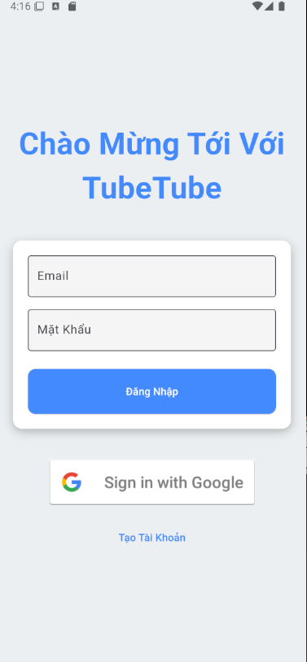
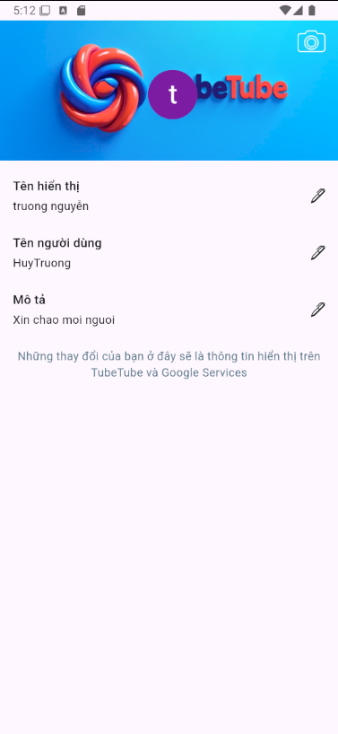

# tubetube

A new Flutter project.

## Getting Started

This project is a starting point for a Flutter application.

A few resources to get you started if this is your first Flutter project:

- [Lab: Write your first Flutter app](https://docs.flutter.dev/get-started/codelab)
- [Cookbook: Useful Flutter samples](https://docs.flutter.dev/cookbook)

For help getting started with Flutter development, view the# CHỨC NĂNG VÀ GIAO DIỆN

## **1 Giao diện đăng nhập, đăng ký**

-Giao diện trang đăng nhập: có 2 phương thức đăng nhập bằng google hoặc
sử dụng email và mật khẩu để đăng nhập

Hình:Giao diện trang đăng nhập.

-Giao diện trang đăng ký:

Hình:Giao diện trang đăng ký.

-Nếu lần đầu đăng nhập sẽ hiển thị giao diện nhập tên người dùng (Đối
với người đăng ký thì sẽ phải nhập thêm tên hiển thị).

Hình: Bên trái là giao diện lần đầu của đăng nhập bằng tài khoản Google.
Bên phải là giao diện đăng nhập bằng email/mật khẩu.

## **2 Giao diện trang chủ.**

-Sau khi đăng nhập thành công và đã điền tên người dùng thì sẽ chuyển
sang trang chủ: Sẽ hiển thị các bài video với lượt xem và người đăng
cùng với thời gian đăng video.

Hình:Giao diện trang chủ ứng dụng.

-Trang xem videos ngắn:Có thể lướt xuống để xem video ngắn tiếp theo.

Hình:Trang xem videos ngắn.

> -Khi nhấn vào nút đăng tải
> () thì sẽ hiển thị 1 Pop-up tác vụ như
> sau:
>
> 
>
> Hình:Sau khi nhấn nút đăng tải.
>
> -Giao diện trang tìm kiếm: Khi nhập vào ô tìm kiếm thì sẽ tìm được
> video hoặc kênh của người dùng có tên giống với những gì đã nhập.
>
> 
>
> Hình:Giao diện trang tìm kiếm.

-Khi nhấn vào nút thoát
() thì sẽ đăng xuất khỏi tài khoản hiện tại
và trở lại trang đăng nhập.

Hình: Khi nhấn vào nút đăng xuất.

-Khi nhấn vào ảnh đại diện của bản thân
() sẽ chuyển sang trang cài người dùng:

Hình:Giao diện trang người dùng.

**\
**

## **3 Giao diện trang người dùng.**

-Đổi thông tin người dùng: thay đổi thông tin của người dùng hiển thị
trong TubeTube.

Hình:Giao diện trang đổi thông tin người dùng.

-Thao tác thay đổi thông tin người dùng:

Hình:Thao tác thay đổi mô tả của người dùng.

-Trang kênh đã đăng ký: Cho biết các kênh đã đăng ký và nếu bấm vào sẽ
chuyển trực tiếp tới kênh của người dùng này.

Hình:Giao diện của trang kênh đã đăng ký.

-Trang chính sách sử dụng: hiển thị chính sách sử dụng của TubeTube và
cách liên hệ admin.

Hình:Giao diện trang chính sách sử dụng của TubeTube.

-Nhấn vào nút
() để chuyển tới giao diện kênh của bản
thân để quản lý video:

Hình:Giao diện trang kênh của bản thân.**\
**

## **4.Giao diện đăng tải, chỉnh sửa, Ẩnvà sửa video dài.**

-Khi nhấn vào nút (Tạo Video Dài) :

Hình:Giao diện của nút Tạo Video Dài.

-Giao diện sau khi nhấn vào nút Tạo Video Dài : Sẽ cho chọn Video muốn
đăng tải từ trong điện thoại.

Hình:Giao diện Sau khi chọn xong Video muốn đăng tải.

-Giao diện nhập chi tiết nội dung của Video muốn đăng tải: Nút Chọn Ảnh
Video sẽ cho phép chọn ảnh từ điện thoại.

Hình:Giao diện nhập chi tiết nội dung của Video muốn đăng sau khi điền
đầy đủ thông tin.

-Sau khi nhấn nút đăng Video: thì sẽ đăng Video thành công TubeTube và
được điều hướng về trang chủ.

Hình:Sau khi đăng Video Thành Công.

-Các tương tác với Video của chủ sở hữu: Nhấn vào nút
() nằm ở phía cuối bên phải của mỗi video
để chọn thao tác.

Hình:Giao diện của tương tác Video của chủ sỡ hữu.

-Thao tác sửa thông tin Video:

Hình:Giao diện trang chỉnh sửa video và sau khi chỉnh sửa xong.

-Thao tác ẩn Video: Đối Với Video bị ẩn thì sẽ không hiển thị đối với
người khác còn người sỡ hữu và Người quản lý sẽ biết Video đó đã bị ẩn.

Hình:Giao diện của Video đối với người sỡ hữu và 1 người bình thường.

-Thao tác Xóa Video:

Hình:Giao diện xóa Video và sau khi xóa xong.

## **5 Giao diện đăng tải, chỉnh sửa, Ẩnvà sửa video ngắn.**

-Khi nhấn vào nút (Tạo Video Ngắn) :

-Giao diện sau khi chọn video ngắn thành công thì sẽ đẩy sang giao diện
cắt video ngắn: Sẽ cho chọn khoảnh khắc video ngắn muốn đăng lên.

Hình:Giao diện đăng video ngắn.

-Sau khi nhấn nút xong thì sẽ sang giao diện nhập chi tiết video ngắn:

Hình: Giao diện nhập chi tiết video ngắn.

-Các tương tác với Video của chủ sở hữu: Nhấn vào nút
() nằm ở phía cuối bên phải của mỗi video
để chọn thao tác:

Hình:Các thao tác với Video ngắn.

-Thao tác chỉnh sửa chi tiết video: Thay đổi chú thích Video

Hình: Giao diện chỉnh sửa Video ngắn.

-Thao tác ẩn Video:Chỉ có người sỡ hữu và người quản lý mới có thể thấy
các video bị ẩn

Hình:Thao tác ẩn Video.

-Thao tác xóa video ngắn:

Hình:Giao diện sau khi xóa video ngắn.

## **6 Tương tác với Video dài.**

-Khi bấm vào xem 1 video dài trong trang chủ sẽ chuyển tới giao diện xem
video dài này:

Hình:Giao Diện Của 1 video sau khi bấm vào.

-Các chức năng của Video dài:

> \+ : phát Video hiện tại
>
> \+, : tua video về phía trước hoặc phía
> sau.
>
> \+: Hiển thị chủ video và đăng ký để theo
> dõi kênh của người dùng này.
>
> \+, : Tương tác với Video bằng cả thả tim
> để thể hiện sự yêu thích với video này.
>
> \+ : Chia sẻ Video với người khác để xem
> ngay lập tức.
>
> 
>
> Hình:Giao diện sau khi nhấn vào nút chia sẻ.
>
> \+: đây là khu vực bình luận
>
> +Phần còn lại phía dưới Video : là hệ thống gợi ý các video mới
>
> 
>
> Hình:giao diện của gợi ý video khác.

-Đối với khu vực bình luận thì sẽ hiển thị các bình luận đầu tiên:

Hình:Giao diện khu bình luận nếu có bình luận.

-Khi nhấn vào khu bình luận sẻ hiển thị khu vực bình luận:

Hình:Giao diện khu bình luận.

**\
**

## **7 Tương tác với Video ngắn.**

-Giao diện của trang xem Video ngắn:

Hình:Giao diện của trang xem video ngắn.

\- Các chức năng của Video ngắn:

> +Nhấn vào bất cứ đâu ở video ngắn: sẽ dừng video , nếu bấm lần nữa thì
> sẽ tiếp tục phát video.
>
> \+
> : hiển thị thông tin chủ sỡ hữu video
> ngắn.
>
> \+
> : tắt / bật âm thanh.
>
> \+
> ,
> : Tương tác với video ngắn để thể hiện
> sự yêu thích với video ngắn này.
>
> \+
>  : hiển thị khu bình luận.

-Khu bình luận:

Hình:Giao diện khu bình luận của video ngắn.

**\
**

## **8 Quản lý bình luận của người dùng và chủ sở hữu video.**

-Người dùng có thể xóa và sửa bình luận của bản thân:

Hình:Khả năng tương tác bình luận của người dùng.

> +Sửa bình luận: sẽ hiển thị Pop-up để sửa bình luận và nhấn nút lưu để
> thay đổi.

Hình:Giao diện sửa bình luận và sau khi sửa bình luận xong.

-Chủ video có thể xóa các bình luận không phù hợp :

> +Thao tác xóa bình luận: người dùng bình thường và chủ video đều có
> thể xóa bình luận nhưng chủ sở hữu thì có thể xóa các bình luận khác
> trong video của mình và người dùng chỉ có thể xóa bình luận của bản
> thân mình.
>
> 
>
> Hình: Khả năng tương tác bình luận của chủ sỡ hữu video.
>
> 
> 
>
> Hình:Giao diện xóa bình luận và sau khi xóa xong bình luận.

## **4.9 Quản lý Video dài , Video ngắn bởi người quản lý.**

-Cấm các video hoặc video ngắn: Được sử dụng để cấm hiển thị và sử dụng
các video không phù hợp với chính sách của TubeTube.

Hình:Khả năng cấm video.

-Sau khi bị cấm: thì chỉ có chủ video với người quản lý mới thấy được
video này nhưng mà không thể bấm vào xem được.

Hình:Video sau khi bị cấm.

## **10 Giao diện kênh của người dùng.**

-Khi nhấn vào 1 kênh của người dùng khác:

Hình:Giao diện kênh của người dùng khác.

-Ở trang Home : sẽ hiển thị cả 2 nội dung video dài và video ngắn.

Hình:Giao diện trang Home.

-Ở trang Videos:

Hình:Giao diện trang videos.

-Ở trang Shorts:

Hình:Giao diện trang Shorts.

-Ở trang About: Mô tả của người dùng này.

Hình:Giao diện trang About.

# KẾT LUẬN VÀ HƯỚNG PHÁT TRIỂN

## **1 Vấn đề đã giải quyết**

-Đã xây dựng được ứng dụng TubeTube với giao diện đẹp và tối giản , thao
tác dễ dàng

-Xây dựng thành công chức năng:

+Quản lý Video ngắn

+Quản lý Video dài

+Quản lý bình luận

+Quản lý người dùng

-Có hệ thống kiểm duyệt nội dung video

-Có 2 phương thức đăng nhập : đăng nhập bằng google hoặc đăng nhập bằng
email/password thông qua đăng ký trước đó.

-Ứng dụng hoàn toàn online và có thể đi vào hoạt động ngay lập tức mà
không cần chạy server.

-Dễ dàng đăng tải video dài, video ngắn và quản lý bình luận các video
của người dùng.

## **2 Vấn đề chưa giải quyết**

-Chưa xây dựng hệ thống thông báo đẩy.

## **3 Hướng phát triển**

-Tích hợp AI cho hệ thống gợi ý video.

-Xây dựng hệ thống thông báo đẩy.

-Xậy dựng hệ thống kiểm duyệt nội dung bằng AI để đánh giá video của
người dùng có phù hợp hay không trước khi đăng lên trên TubeTube.

-Thương mại hóa thông qua quảng cáo ở mỗi 1 hoặc 2 video và bán gói
không quảng cáo rồi dùng số tiền đó để mở rộng băng thông cho ứng dụng
và nâng cấp ứng dụng.

#  TÀI LIỆU THAM KHẢO

\[1\] [video_player \| Flutter
package](https://pub.dev/packages/video_player)

\[2\] [Tài liệu  \|  Firebase
Documentation](https://firebase.google.com/docs?hl=vi)

\[3\] [flutter_riverpod \| Flutter
package](https://pub.dev/packages/flutter_riverpod)

\[4\] [YouTube YouTube
https://www.youtube.com](https://www.youtube.com/)

\[5\] [BiliBili BiliBili
https://www.bilibili.tv](https://www.bilibili.tv/)

\[6\] [TikTok - Make Your Day](https://www.tiktok.com/vi-VN/)

\[7\] [Docs \| Flutter](https://docs.flutter.dev/)

\[8\] [Dart documentation \| Dart](https://dart.dev/guides) 

